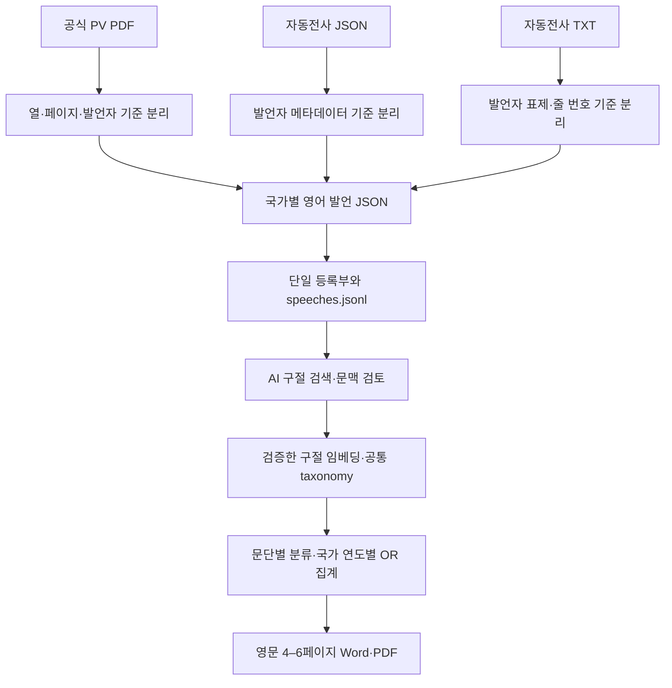

# UNGA AI 분석 아키텍처

## 현재 원문 정책

분석 단위는 국가–연도다. 국가를 대표한 주요 일반토의 발언을 해당 국가의 대표 입장으로 처리하며, 발언자의 직급·레벨에 따른 분류·비교·가중치는 적용하지 않는다. 이름과 원문 소개는 출처 확인용으로만 보존한다.

사용자 지시에 따라 **영어 속기록을 확정 원문**으로 사용한다. 2017–2024년은 공식 영어 PV 회의록에서 국가별 주요 연설을 추출하며 2019년도 포함한다. 2025·2026년은 보유한 영어 자동전사 JSON/TXT가 원문이다. 별도 국가별 PDF가 없어도 분석 입력에 포함한다. 자동전사를 공식 UN 기록으로 표시하지 않는다.

2017–2024년 1,528개, 2025년 189개, 2026년 171개로 총 1,888개 국가–연도 발언을 준비한다. 2026년 마지막 날이 미수집이므로 해당 연도는 부분 자료다. 현재 수치와 무결성 결과는 [준비 상태](output/corpus_preparation/README.md)와 [release_status.json](output/corpus_preparation/release_status.json)을 따른다.

## 데이터 흐름



`accepted`는 분석에 쓸 원문을 선택했다는 뜻이다. 원음 검증·AI 판정·정책 분류 완료를 뜻하지 않는다. 자동전사도 같은 입력 파일로 들어가며 모든 AI·주제 판정은 `Pending`으로 시작한다.

## 실행과 모듈

**임베딩 API + Codex 구독 방식이다.** 준비 확인은 `python -m unga_analysis analyze`, 시작 지시 후 실행·재개는 `python -m unga_analysis analyze --execute --max-cost-usd 1`이다. `analysis/subscription.py`가 텍스트 작업을 구독 세션에 파일로 전달하며 `awaiting_subscription_review` 상태에서 Codex가 답을 작성하고 재개한다. API는 임베딩만 허용한다. 군집·집계·출력은 로컬이다. Day 6가 새로 들어오면 필요한 전처리부터 수행한다. [실행·비용·재개 안내](docs/ANALYSIS_WORKFLOW.md).

```powershell
python -m unga_analysis prepare
python -m unga_analysis status
python -m unga_analysis screen
```

| 구성 | 역할 |
|---|---|
| `unga_analysis/preparation/segment.py` | 공식 PDF·ASR JSON·ASR TXT를 국가별 주요 발언으로 분리 |
| `unga_analysis/preparation/publish.py` | 분리·등록·정규화·무결성 처리를 연결하는 단일 준비 경로 |
| `unga_analysis/preparation/audit.py` | 해시·위치·중복·구절 분할의 본문 보존 확인 |
| `unga_analysis/adapters.py` | 출처 구조를 읽고 원본 위치 보존 |
| `unga_analysis/pipeline.py` | 등록·상태·정규화·캐시·공통 구절 생성 |
| `unga_analysis/contracts.py` | 중복 대표본과 잘못된 입력 차단 |
| `unga_analysis/labels.py`, `aggregate.py` | 근거 있는 분류와 OR/NA 집계 계약 |
| `unga_analysis/screening.py`, `config/ai_search_terms.json` | AI 표현·관련 개념·간접 표현 후보 검색, 원문 위치 보존, 확정 판정은 하지 않음 |
| `config/analysis.toml` | 원문 확정 연도·부분 수집 연도·분석/보고서 설정 |
| `config/source_manifest.jsonl` | 실제 분석에 포함할 국가–연도 대표본 |
| `output/pipeline/speeches.jsonl` | 모든 포함 연도의 단일 분석 입력 |
| `unga_analysis/analysis/workflow.py` | 분석 전체 실행·사전 점검·Day 6 반영·중단/재개 |
| `unga_analysis/analysis/provider.py` | `.env`·OpenAI Responses/Embeddings·구조화 출력·캐시·비용 상한 |
| `unga_analysis/analysis/review.py`, `discovery.py` | 전체 텍스트 검토·임베딩·군집·taxonomy |
| `unga_analysis/analysis/classification.py`, `aggregation.py` | 복수 주제·UN 입장·표현 검토, 분모/부분 연도 가드와 집계 |
| `unga_analysis/analysis/references.py`, `reporting.py` | 참고자료·UN 배경 확인, 근거 기반 작성·Word/PDF 렌더링 |

`register`와 `ingest`는 개별 입력 유지보수용 CLI다. 일반적인 원문 추가는 `prepare`로 처리한다. 수집·중복 정리·제출 PDF 대조에 사용했던 일회성 스크립트는 `archive/`에 보관한다.

`prepare`는 무결성 점검 후 로컬 후보 검색도 갱신한다. `screen`은 검색만 다시 실행한다. 결과는 `output/screening/`에 저장하며 입력·등록부·검색어·코드 해시를 기록한다. 등록된 전사 1건당 국가–연도 1건만 검색하고, PDF 비교 근거는 별도 관측치로 넣지 않는다. 중복 행은 검색 시작 전에 차단한다.

`AI`, `A.I.`, `artificial intelligence`, `superintelligence / super intelligence`, `AGI / ASI`, 생성형 AI, 기계학습·대규모 언어모델 등의 후보를 찾는다. 약어·관련 개념·간접 표현은 검색 등급을 구분하며, 군사 정보의 `intelligence`나 `said` 안의 `ai`를 AI 용어로 잡지 않는다. 검색어 적중 수를 국가 수로 집계하지 않으며 미적중은 AI 미언급 확정이 아니다.

## 형식 차이와 오류 방지

- PDF에는 실제 페이지·블록·좌표, JSON에는 JSON pointer·원본 음성 시간, TXT에는 실제 줄 범위·발언자 표제 줄·발언 시작 시각을 보존한다. TXT의 발언 시작 시각을 문단별 정확한 시각으로 바꾸지 않는다.
- 의장·사무총장·옵서버·답변권·다른 의제 발언은 회원국 주요 연설에서 제외한다. 2020·2021년 영상 연설은 공식 회의록 부록을 사용한다.
- 회의 한 파일을 한 국가의 연설로 넣지 않는다. 먼저 국가별 JSON을 등록한다. 동일 국가–연도에 다른 본문이 충돌하면 준비를 중단한다.
- 긴 전사 문단은 최대 350단어·3,000문자의 연속 구절로 나눈다. 중복·요약·교정 없이 원문 순서를 유지하고, 추출 문단 번호와 문자 범위를 기록한다.
- 원본 및 추출본 해시가 달라지면 캐시를 재사용하지 않는다. 구절을 다시 이었을 때 원래 본문과 같아야 한다.
- 미확보·미검토 자료는 AI 미언급이나 0으로 채우지 않는다. 2026년 부분 수집은 출처의 공식/자동전사 여부와 별도로 표시한다.

## 분석 방법과 경계

다음 분석은 검증한 AI 구절 전체와 필요한 문맥만 임베딩하고, 전 연도 공통 taxonomy로 문단별 복수 분류를 수행한다. 임베딩 모델 설정은 유지했으며 API 호출은 실행하지 않았다. 이전 분석 결과를 새 원문에 자동 적용하지 않는다. 상세한 군집·용어 추세·UN 메커니즘·보고서 규칙은 [ANALYSIS_PROTOCOL.md](ANALYSIS_PROTOCOL.md)를 따른다.

지역 매핑은 `config/un_regional_groups.csv`의 193개 회원국에 대해 2026-09-25 기준을 고정 적용한다. 미국은 정식 그룹 비회원으로 분리하고, 튀르키예는 UN 선거상 관례에 따라 WEOG에 한 번 배정한다. 키리바시는 현재 명단의 Asia-Pacific 분류를 따른다. 근거 HTML은 `output/primary_sources/`에 보존한다.

로컬 AI 후보 검색은 실제 자료에서 실행했다. 후속 분석 경로도 구현하고 가짜 자료로 전체 실행·보고서 생성까지 검증했다. 실제 자료의 유료 문맥 검토·임베딩·분류는 시작 지시 전이다. 모델 검토와 사람 검증을 구분하고, 미해결 판정은 불확실로 내보낸다. 최신 워크플로우 상태는 `output/workflow_readiness.json`과 [실행 안내](docs/ANALYSIS_WORKFLOW.md)를 따른다.

## Subscription execution update (2026-09-29)

`analysis/scope.py` selects whole candidate speeches and deterministic year/region/source negative audits. `review.py` expands audit-hit strata and retains unselected passages as Pending. `SubscriptionProvider.collect` exports every independent stage job before pausing. Classification batches carry taxonomy once; both source-grounded passes remain separate. Annual detection lower bounds use obtained speeches while theme denominators retain full-speech code-specific resolution. `reporting.py` flows sections over 4-6 pages and writes numbered source notes. `workflow.validate_final_day` checks internal year/session/language/day before source ingestion. No intake file becomes a 2026 observation by renaming alone.
