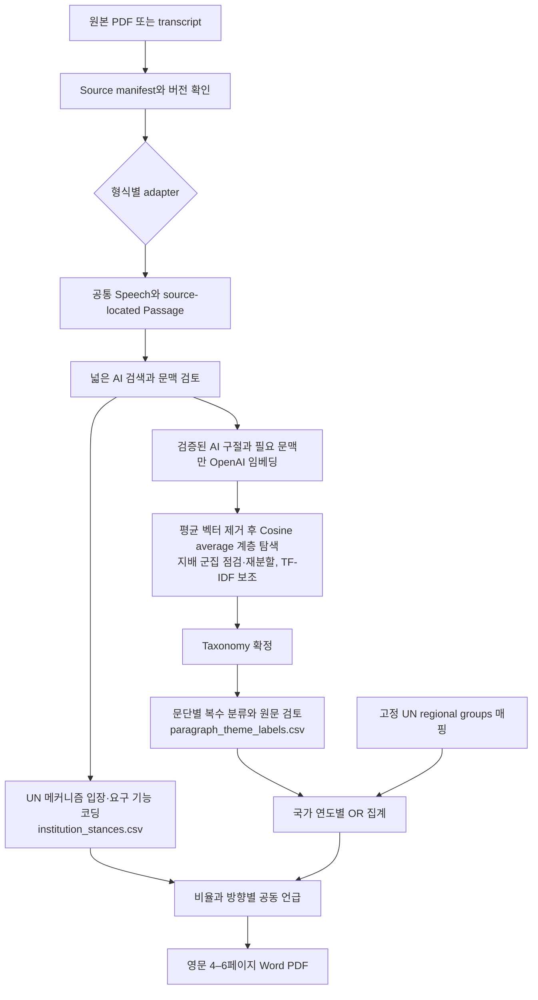

# UNGA AI 분석 아키텍처

현재 단계는 **지시사항에 맞춘 입력 구조 준비 / 분석 실행 중단**이다. 2019년은 검색 중이고, 2026년은 사용자가 제공할 transcript를 기다린다. 구식 분석·보고서 생성 코드를 제거하고 원본 자료와 재사용 가능한 추출·검토 근거만 별도 캐시로 보존했다. 현재 모델의 임베딩·taxonomy·최종 보고서는 아직 생성하지 않았다. 정리 작업에서 유료 API 호출, PDF 재추출, 재임베딩, 주제 재분류는 하지 않았다.

## 데이터 흐름

## 모듈과 경계

| 구성 | 역할 |
|---|---|
| `config/analysis.toml` | 대기 연도, 공식 지역 매핑, 분석 설정, 유료 호출 금지, 보고서 제약 |
| `config/source_manifest.jsonl` | 국가–연도별 원본 버전, 대표본 여부, 해시, 위치, 출처 종류와 확인 상태 |
| `unga_analysis/contracts.py` | 중복 대표본·연도·출처·직급 검증 |
| `unga_analysis/adapters.py` | PDF 캐시와 TXT/DOCX/JSON/JSONL을 공통 passage로 변환 |
| `unga_analysis/pipeline.py` | 등록·상태·정규화·추출 캐시 관리 |
| `unga_analysis/selection.py` | EN 우선, 국가–연도당 한 판본 선택, 대체 언어 보류 |
| `unga_analysis/labels.py` | 문단별 주제 판정·UN 메커니즘 입장 기록의 필드·근거·검토 상태 검증과 캐시 키 계약 |
| `unga_analysis/aggregate.py` | 검토 완료 판정의 OR/NA, 분류 완료 여부, 연도별 비율 최소 N, UN 명시 요구 선별 규칙; 옛 결과표 자동 수입 없음 |
| `scripts/build_un_groups.py` | 캐시된 공식 UN 명단으로 고정 지역 매핑 생성 |
| `config/theme_taxonomy.json` | 주제 발견·검토 전임을 명시한 빈 taxonomy |
| `cache/extraction/` | 원문 추출·OCR·출처 확인 기록; manifest로 선택한 원문만 재사용 |
| `cache/source_review/` | PDF 원문 검토 근거; 새 원문 선택·taxonomy와 대조하기 전에는 참고 기록 |
| `output/pipeline/cache_registry.jsonl` | 기존 중간 결과의 단계·파일 해시·재사용 범위 |
| `tests/test_pipeline.py` | 형식별 위치 보존, 혼합 발언 차단, 대기 상태, 캐시와 지역 예외 검증 |

입력·추출과 AI 탐지/정책 판정을 분리한다. 추출 성공은 AI 판정 완료를 뜻하지 않는다. 원본이 비어 있거나 읽히지 않으면 unresolved로 남기고, 누락 연도·국가는 0으로 만들지 않는다. 기존 PDF 캐시는 기존 원본 해시와 캐시 해시를 확인한 뒤 사용한다.

## 식별자와 캐시

다음 실행의 선택 모델은 OpenAI `text-embedding-3-large`(3072차원)다. API는 EN 단일 판본 선택·추출·AI 후보 검색·문맥 검토를 마친 구절을 벡터로 바꾸는 단계에만 연결한다. 전체 연설문 임베딩은 선택하지 않았다. 현재 설정만 기록했으며 API 연결 구현·유료 호출은 실행하지 않았다. 기존 MiniLM 벡터와 OpenAI 벡터는 혼합하지 않는다. 원문 추출과 판정 근거는 재사용하되 모델 변경으로 필요한 AI 구절 임베딩은 후속 실행 시 새로 생성한다. 키 위치와 호출 예시는 `docs/methodology_alignment_and_openai.md`를 참고한다.

- 국가–연도: `YEAR_ISO3`. 국가별 복수 언어·수정본은 별도 `source_id`를 가지며 대표본은 하나만 accepted다.
- 원문: SHA-256 + adapter 버전 + 선택 범위 + 추출 설정으로 캐시한다. 입력 해시가 다르면 기존 캐시를 자동 적용하지 않는다.
- 의미 청크/임베딩: 원문 해시 + 청크 text/설정 + 모델 및 revision으로 식별한다.
- 분류: 청크 키 + taxonomy 해시 + 프롬프트 해시 + 사용 모델/검토 기록을 연결한다.
- 지역 매핑 변경은 추출·임베딩·주제 분류 캐시 키에 들어가지 않는다. 집계와 시각화만 새로 만든다.

새로 정규화한 텍스트는 `Pending` 상태다. 기존 검토 결과는 원본 해시·근거 ID·새 taxonomy를 확인한 뒤 재사용한다. 옛 결과표를 현재 분석으로 가져오는 import/regroup 실행 경로는 제거했다. 새 transcript의 주제는 수령 후 검토한다.

## 지역 기준

공식 근거: [UN DGACM Regional groups of Member States](https://www.un.org/dgacm/en/node/3935). 원문 HTML과 retrieval 해시를 `output/primary_sources/UN_regional_groups.html`에 보존했다. 매핑 기준일은 **2026-09-25, America/New_York**이며 2017–2026 비교 전체에 동일한 분석용 매핑을 적용한다. 과거 각 시점의 실제 가입 이력을 재구성한 표가 아니다.

`config/un_regional_groups.csv`는 193개 회원국을 정확히 한 번 포함한다. African States 54, Asia-Pacific States 54, Eastern European States 23, GRULAC 33, WEOG 28, 정식 그룹 비회원 1이다.

- 미국: 공식 설명상 어느 그룹에도 정식 소속되지 않는다. WEOG 옵서버·선거상 관계를 별도 필드에 기록하고, 주집계에서는 정식 그룹 비회원으로 분리한다.
- 튀르키예: Asia-Pacific 및 WEOG에 모두 참여한다. UN이 명시한 선거상 분류를 단일 배정 규칙으로 사용해 WEOG에 한 번만 센다.
- 키리바시: 현재 공식 명단에 Asia-Pacific으로 기재되어 있다. 과거 비가입 설명을 현재 매핑에 적용하지 않는다.
- 이스라엘: 공식 명단과 2004년 영구 갱신 설명에 따라 WEOG에 배정한다.

Key Facts 분모는 **해당 그룹의 검토한 Member State 주요 연설 수**다. Themes 분모는 **해당 그룹의 AI 언급 및 주제 분류 완료 국가 수**다. 그룹 내 빈도는 그룹 공동 입장을 뜻하지 않는다. 회원국이 아닌 SG/PGA/EU/옵서버와 답변권·진행 발언은 별도 맥락 자료로 관리한다.

## 자료 대기와 기존 산출물

같은 국가·연도의 주요 연설에 EN이 있으면 EN 한 판본만 분석한다. FR 등 나머지 언어판은 원본을 보존하되 추출/OCR·AI 탐지·키워드·임베딩·분류·집계 입력에서 제외한다. EN이 없을 때도 한 언어판만 선택한다. EN이 읽히지 않으면 다른 언어로 자동 대체하지 않고 미해결로 남긴다. 기존 후보 캐시에 남아 있는 대체 언어판은 향후 실행에서 선택 원문과 대조해 제외하며, 현재는 재처리하지 않는다.

`scope.awaiting_user_sources = [2019, 2026]`가 현재 실행 제약이다. 이후 자료를 등록하고 연설 범위·버전·완전성을 확인한 다음 이 목록에서 해당 연도를 제거한다. 파일을 폴더에 넣었다는 사실만으로 자동 승인·집계하지 않는다. 이는 별도 사용자 재승인 절차가 아니라 분석자가 수행할 출처 확인 단계다.

외부 2026 자동전사에 기반한 분석 결과와 이전 지역별 통계는 제거했다. 재사용 출처 자료는 `cache/retained_inputs/`에 격리했고, 현재 코드가 여기의 판정·통계를 자동 읽는 경로는 없다. 최종 결과는 사용자 자료와 검토된 분류로 새로 생성해야 한다.

2018년 중복 문제와 2019년 공백, 미확인 발언자·직급·날짜는 계속 남아 있다. 이 구조가 메타데이터나 원문 검증 완료를 뜻하지 않는다. 사용자가 요청한 최종 파일명·네 섹션·4–6페이지 및 차트 요구는 설정에 보존했고, 자료가 들어오면 그 조건으로 보고서를 완성한다.

## 자료 수령 후 실행

현재는 사용자의 지시에 따라 임베딩 비용 분석 결과 전달 후 실행을 중단한 상태다. 아래 절차는 사용자가 후속 실행을 요청한 뒤 수행한다. 새 자료가 도착하거나 지침이 추가됐다는 이유만으로 자동 실행하지 않는다. 연도별 주요 AI 표현의 첫 관찰·여러 국가에서의 반복 등장·확산을 원문으로 검증하고, Role of UN은 `reference/`의 report와 note/summary를 먼저 읽어 제도적 맥락을 파악한 뒤 작성한다. 상세 기준은 `ANALYSIS_PROTOCOL.md`를 따른다.

1. 원본을 `data/incoming/2019/` 또는 `data/incoming/2026/`에 보존한다.
2. 실제 파일 구조와 주요 연설 범위를 확인하고 source manifest를 등록한다. 필요한 경우 adapter만 추가한다.
3. 해당 연도의 대기 설정을 갱신하고 정규화한다. 선택 원문과 일치하는 추출 캐시를 재사용한다.
4. 검증한 AI 구절 **전체**(국가–연도당 1개 표본 추출 금지)를 전 연도 동일 OpenAI 모델로 임베딩한다. 평균 벡터를 빼고 다시 정규화한 뒤 cosine/average로 여러 절단 수준을 비교한다. 한 군집이 40%를 넘으면 그 군집을 같은 방식으로 재분할하고, 진단 결과는 `discovery_diagnostics.json`에 남긴다. 대표·경계 문단과 TF-IDF를 검토해 공통 taxonomy를 확정하고, **문단 단위**로 모든 주제를 판정한다. `cache/source_review/`의 국가–연도·페이지 단위 기록은 검토 보조용이며 문단 판정을 대신하지 않는다.
5. 국가–연도 및 UN regional groups 집계, 조건부 공동 언급, 표·차트·정책 서술을 갱신한다. 연도별 주제 비율은 분류 완료 AI 언급국 N≥20인 연도에만 표시하고, 그 미만인 연도는 건수와 사례로 서술한다. UN 메커니즘은 `institution_stances.csv`에 mention/welcome/support/request/concern/opposition/commitment, 요구 기능, UN 역할 명시 여부(explicit/generic)로 기록한다.
6. 필수 CSV/방법론/Word/PDF를 생성하고 4–6페이지 렌더 검증을 완료한다.

현재 실행 가능한 CLI는 `status`, `register`, `ingest`다. OpenAI 호출, 의미 탐색, 전체 집계·시각화 및 Word/PDF 보고서 생성은 다음 승인된 실행 단계에서 구현·검증할 항목이다. 설계 문서에 적혀 있다는 이유로 이미 실행됐거나 모두 구현됐다고 간주하지 않는다.
