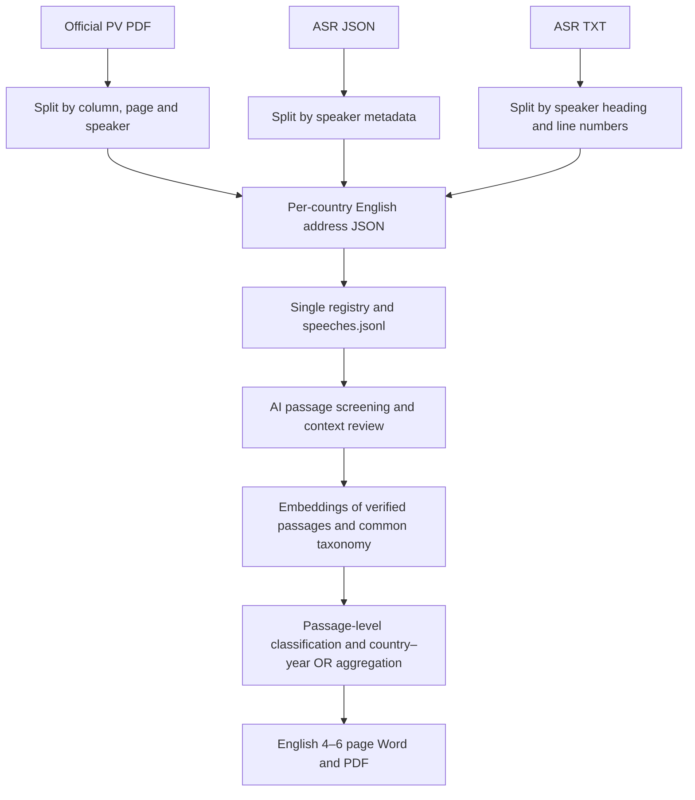

# UNGA AI analysis architecture

## Source policy

The unit of analysis is the country–year. A country's main General Debate address is treated as that country's position for the year. There is no classification, comparison or weighting by speaker rank. Speaker names and introductions are kept only to verify attribution.

At the user's instruction, **English verbatim records are the canonical sources**:

- 2017–2024, including 2019: country main addresses extracted from official English PV meeting records.
- 2025 and 2026: English automatic-transcript JSON/TXT files. No separate country PDF is needed, but automatic transcripts are never labelled as official UN records.

The corpus holds 1,908 country–year addresses: 1,528 for 2017–2024, 189 for 2025 and 191 for 2026. The 20 final-day (2026-09-28) addresses were added without duplicates, so all six days are covered. Current counts and integrity results are in [output/corpus_preparation/README.md](output/corpus_preparation/README.md) and [release_status.json](output/corpus_preparation/release_status.json).

## Data flow



`accepted` means only that the source has been selected for analysis. It does not mean audio verification, AI judgement or theme classification is complete. All AI and theme labels in the canonical input start as `Pending`; analysis results are stored per run in `output/analysis/runs/<run-id>/`.

## Execution and modules

The analysis uses **the embeddings API plus a subscription agent session**. `python -m unga_analysis analyze` is the free readiness check; `analyze --execute --max-cost-usd 1` runs and resumes. `analysis/subscription.py` hands text work to the agent session (Codex or Claude Code) as request/response files and pauses in `awaiting_subscription_review`. Only embeddings use the API. Clustering, aggregation and output are local. See [docs/ANALYSIS_WORKFLOW.md](docs/ANALYSIS_WORKFLOW.md).

```powershell
python -m unga_analysis prepare
python -m unga_analysis status
python -m unga_analysis screen
```

| Component | Role |
|---|---|
| `unga_analysis/preparation/segment.py` | Split official PDFs, ASR JSON and ASR TXT into country main addresses |
| `unga_analysis/preparation/publish.py` | Single preparation path linking splitting, registration, normalization and integrity checks |
| `unga_analysis/preparation/audit.py` | Hash, locator, duplicate and passage-split text-preservation checks |
| `unga_analysis/adapters.py` | Read source structures and keep original locators |
| `unga_analysis/pipeline.py` | Registry, status, normalization, cache and common passage generation |
| `unga_analysis/contracts.py` | Block duplicate representatives and invalid input |
| `unga_analysis/labels.py`, `aggregate.py` | Evidence-backed labels and OR/NA aggregation contract |
| `unga_analysis/screening.py`, `config/ai_search_terms.json` | Screen for AI terms, related concepts and indirect cues with source locators; no final judgement |
| `config/analysis.toml` | Canonical source years and analysis/report settings |
| `config/source_manifest.jsonl` | Country–year representatives included in the analysis |
| `output/pipeline/speeches.jsonl` | Single analysis input for all included years |
| `unga_analysis/analysis/workflow.py` | Full run, preflight, final-day intake, pause and resume |
| `unga_analysis/analysis/scope.py` | Review selection: whole candidate speeches plus stratified negative audits |
| `unga_analysis/analysis/provider.py`, `subscription.py` | `.env`, OpenAI embeddings, structured outputs, cache, cost ceiling, file handoff |
| `unga_analysis/analysis/review.py`, `discovery.py` | Full-text review, embeddings, clustering, taxonomy |
| `unga_analysis/analysis/classification.py`, `aggregation.py` | Multi-label themes, UN stances, keyword review, denominator guards and aggregation |
| `unga_analysis/analysis/references.py`, `reporting.py` | Reference and UN-background checks, evidence-based drafting, Word/PDF rendering |

`register` and `ingest` are maintenance CLIs for individual inputs; new sources are normally added with `prepare`. One-off collection and cleanup scripts are kept only in `archive/`.

`prepare` refreshes local screening after the integrity checks; `screen` re-runs screening only. Results go to `output/screening/` with input, registry, lexicon and code hashes. Each registered transcript is screened once per country–year, and PDF comparison evidence is never added as an extra observation.

Screening looks for `AI`, `A.I.`, `artificial intelligence`, `superintelligence`, `AGI`/`ASI`, generative AI, machine learning, large language models and similar terms. Abbreviations, related concepts and indirect cues are graded separately. Military `intelligence` or the `ai` inside `said` are not matched. Term hits are not country counts, and a non-hit is not a confirmed non-mention.

## Format differences and safeguards

- Locators are preserved per format. PDFs keep the physical page, block and coordinates. JSON keeps the JSON pointer and audio time. TXT keeps the real line range, speaker heading line and address start time; that start time is never turned into per-paragraph timestamps.
- The Chair, Secretary-General, observers, rights of reply and other agenda items are excluded from Member State addresses. For 2020 and 2021, video statements come from the official record annexes.
- A meeting file is never entered as one country's address. If different texts conflict for the same country–year, preparation stops.
- Long transcript paragraphs are split into consecutive passages of at most 350 words / 3,000 characters. The original order is kept, with no duplication, summarising or correction, and paragraph numbers and character ranges are recorded.
- A cache is not reused if a source or extraction hash changes. Rejoined passages must reproduce the original text.
- Missing or unreviewed material is never filled as "no AI mention" or 0.

## Analysis method and boundaries

Only verified AI passages and the context needed to read them are embedded. A single common taxonomy across all years is used for passage-level multi-label classification. Earlier analysis results are never applied to new sources automatically. The detailed rules for clustering, keyword trends, UN mechanisms and the report are in [ANALYSIS_PROTOCOL.md](ANALYSIS_PROTOCOL.md).

- **Regions.** `config/un_regional_groups.csv` fixes the mapping of 193 Member States as of 2026-09-25. The United States is kept separate as a non-member of any group. Türkiye is counted once, in WEOG, following UN electoral practice. Kiribati follows the current Asia-Pacific listing. The source HTML is kept in `output/primary_sources/`.
- **Review scope.** `analysis/scope.py` selects whole candidate speeches plus deterministic year/region/source negative audits. `review.py` expands review to strata where an audit finds AI, and leaves unselected passages Pending.
- **Handoff and classification.** `SubscriptionProvider.collect` exports every independent job of a stage before pausing. Classification batches carry the taxonomy once, and the two source-grounded passes stay separate.
- **Denominators.** Annual detection lower bounds use obtained speeches. Theme denominators are code-specific among resolved AI-positive speeches.
- **Report layout.** `reporting.py` flows the sections over 4–6 pages and writes numbered source notes.
- **Final-day intake.** `workflow.validate_final_day` checks the internal year, session, language and day before a final-day file is ingested. Renaming a file is never enough.

Model review and human verification are kept distinct, and unresolved judgements are exported as Uncertain.
